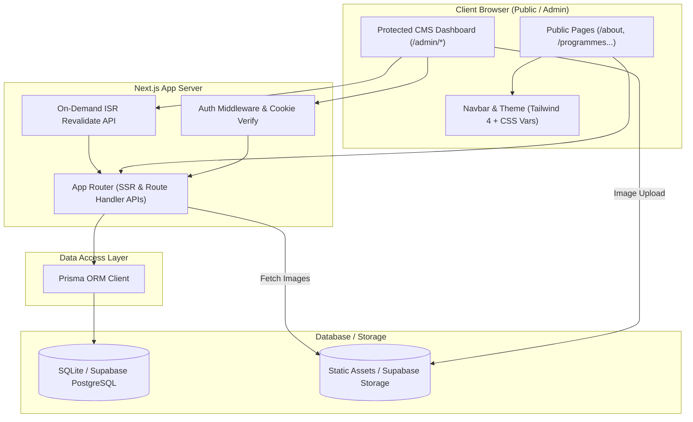

# Nawiri Impact Africa — Codebase & Architecture Map (`codebase_map.md`)

This map outlines the file hierarchy, structural components, configuration setup, and architectural flow of the Nawiri Impact Africa codebase.

---

## 1. Project Directory Structure

```
nawiri-impact-africa/
├── .github/                      # CI/CD Workflows for automated testing/deployment
├── download/                     # Temporary downloads directory
│   └── README.md
├── upload/                       # Uploaded reference resources
│   └── Nawiri_Master_Agent_Prompt.docx # original master prompt specification
├── prisma/                       # Database Configurations
│   ├── dev.db                    # Active SQLite development database (ignored in Git)
│   ├── schema.prisma             # Core Prisma schemas and models (SQLite/PostgreSQL)
│   └── seed.ts                   # Initial seed data script for setting up pages and contents
├── src/
│   ├── app/                      # Next.js App Router (Next.js 16)
│   │   ├── (site)/               # Public-Facing Dynamic Pages
│   │   │   ├── page.tsx          # Landing page containing Sections A–J
│   │   │   ├── about/            # About page (Mission, Vision, leadership & team profiles)
│   │   │   ├── blog/             # Blog list & [slug] individual detail articles
│   │   │   ├── careers/          # Job portal & [slug] applications forms
│   │   │   ├── contact/          # Multi-routing contact form with validations
│   │   │   ├── donate/           # Donation layout (M-Pesa, bank, partnership/volunteers)
│   │   │   ├── impact/           # Stories index containing filtering and grids
│   │   │   ├── programmes/       # Core activities list & [slug] detail pages
│   │   │   ├── reports/          # Annual reports and financial PDF documents library
│   │   │   ├── safeguarding/     # NGO accountability commitments and policy files
│   │   │   └── stories/          # Individual impact story page router
│   │   ├── admin/                # Password-Protected CMS Admin Dashboard
│   │   │   ├── layout.tsx        # Dashboard wrapper, sidebar injection, cookie auth guards
│   │   │   ├── page.tsx          # Redirects /admin straight to /admin/dashboard
│   │   │   ├── blog/             # CRUD dashboard for blog posts
│   │   │   ├── careers/          # CRUD dashboard for job listings
│   │   │   ├── contacts/         # View inbox messages submitted by visitors
│   │   │   ├── dashboard/        # Dashboard overview analytics and metrics cards
│   │   │   ├── home-settings/    # Hero banner, stats arrays, and CTA edits
│   │   │   ├── login/            # Admin authorization interface
│   │   │   ├── partners/         # CRUD manager for partner/donor logos
│   │   │   ├── programmes/       # CRUD editor for the 4 core programme cards
│   │   │   ├── reports/          # Upload manager for financial/annual report files
│   │   │   ├── site-settings/    # Header, footer links, dynamic colors, analytics ID forms
│   │   │   ├── stories/          # CRUD editor for impact stories
│   │   │   └── team/             # CRUD editor for staff members
│   │   ├── api/                  # Back-End Serverless Route Handlers
│   │   │   ├── admin/            # Admin auth (login/logout/check) and dashboard metrics API
│   │   │   ├── contact/          # Processes public form entries
│   │   │   ├── home-settings/    # Updates hero settings
│   │   │   ├── programmes/       # Dynamic retrieval of programme list
│   │   │   └── site-settings/    # Updates site metadata
│   │   ├── globals.css           # Global Tailwind base styles and custom brand CSS variables
│   │   ├── layout.tsx            # Global HTML/Body container, preloads Google Fonts, loads JSON-LD
│   │   ├── loading.tsx           # Global fallback loading skeleton
│   │   └── not-found.tsx         # Curated 404 page
│   ├── components/               # UI Block Components
│   │   ├── admin/                # Sidebar layouts and form footers for administrative panel
│   │   ├── home/                 # Individual sections (Hero, StatsBar, ProgrammesPreview...)
│   │   ├── layout/               # Header Navigation Bar and Footer
│   │   └── ui/                   # Modular design system elements (buttons, inputs, cards)
│   ├── hooks/                    # Reusable React hooks (use-mobile, use-toast)
│   ├── lib/                      # Core System Utilities
│   │   ├── admin-api.ts          # Admin API request fetchers
│   │   ├── admin-auth.ts         # Authentication utility helpers
│   │   ├── db.ts                 # Prisma Client instantiation
│   │   ├── seo.ts                # Structured metadata and JSON-LD sitemap builders
│   │   └── utils.ts              # Class name mergers
│   └── middleware.ts             # Auth path-matching middleware routing
├── tailwind.config.ts            # Tailwind CSS customization controls
├── tsconfig.json                 # Strict TypeScript configuration
├── bun.lock                      # Bun dependencies lockfile
├── package.json                  # Next.js 16, Prisma, Lucide-React, Framer Motion dependencies
└── worklog.md                    # Historical record of code modifications
```

---

## 2. Technical System Architecture

The following diagram illustrates how the Nawiri Impact Africa system handles data from the admin dashboard (CMS) to the front-end interface:



---

## 3. Data Schema to Component Mapping

Here is how data flows from the Prisma database models to specific user-facing layout blocks:

| Database Model | Managed Fields | Target UI Components / Pages |
| :--- | :--- | :--- |
| **SiteSettings** | Name, Tagline, Phone, Address, Socials, Colors, GA4 | `Navbar`, `Footer`, `globals.css` variable injection |
| **HomeSettings** | Hero copy, Stats JSON, CTA copy, Featured Story ID | `Hero`, `StatsBar`, `DonateCta`, `FeaturedStory` |
| **Programme** | Title, cover, accent, target groups, key activities | `/programmes`, `/programmes/[slug]`, `ProgrammesPreview` |
| **Story** | Title, pull quote, cover, location, author role, tags | `/impact`, `/stories/[slug]`, `FeaturedStory` |
| **Report** | Year, title, description, document type, PDF URL | `/reports` (downloadable file cards grid) |
| **Career** | Job title, salary, deadline, urgency status, description | `/careers`, `/careers/[slug]` |
| **TeamMember** | Name, role, bio, is_leadership, profile picture | `/about` (Leadership section, General Team grid) |
| **Partner** | Brand Name, SVG logo, website URL, active status | `/partnerships`, `PartnersStrip` (Home page) |
| **ContactSubmission** | Sender Name, Email, Subject line, text Message | `/admin/contacts` (Admin inbox reader) |
