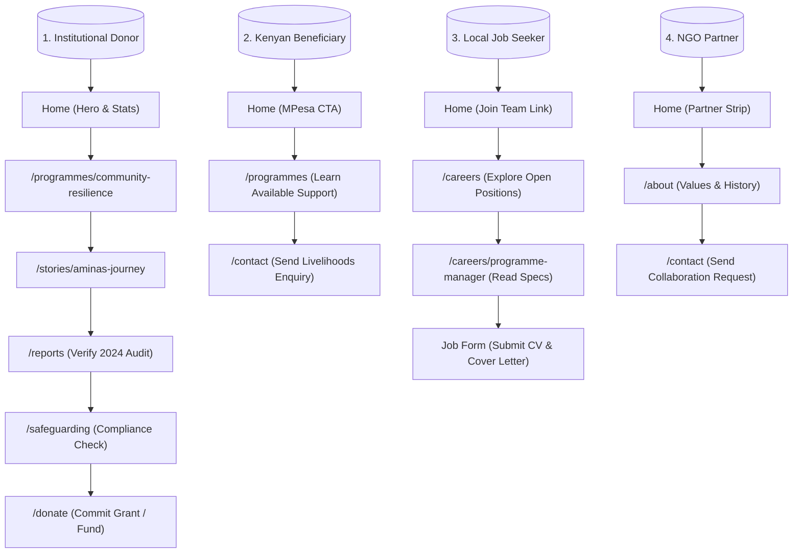

# Nawiri Impact Africa — Sitemap & User Journeys (`sitemap.md`)

This map outlines the page hierarchy, dynamic routes, search-engine indexing configurations, and user experience flows for the Nawiri Impact Africa web platform.

---

## 1. Application Page Directory & Router Sitemap

The application uses the Next.js App Router. The following table represents the complete list of routing paths, the corresponding components, database sources, and SEO properties:

| Route Path | Role / Purpose | Matching UI File | DB Entity Used | Indexing |
| :--- | :--- | :--- | :--- | :--- |
| **`/`** | Home / Landing Page | `src/app/page.tsx` | `SiteSettings`, `HomeSettings`, `Programme`, `Story`, `BlogPost`, `Partner` | Public |
| **`/about`** | About Us, Values, Team | `src/app/about/page.tsx` | `SiteSettings`, `TeamMember` | Public |
| **`/programmes`** | All active NGO Programmes | `src/app/programmes/page.tsx` | `Programme` (published) | Public |
| **`/programmes/[slug]`** | Individual Programme Profile | `src/app/programmes/[slug]/page.tsx` | `Programme` (find by slug) | Public |
| **`/impact`** | Impact Stories & Stats Grid | `src/app/impact/page.tsx` | `Story` (published) | Public |
| **`/stories/[slug]`** | Single Impact Narrative Reader | `src/app/stories/[slug]/page.tsx` | `Story` (find by slug) | Public |
| **`/reports`** | PDF Annual/Financial Reports | `src/app/reports/page.tsx` | `Report` (published) | Public |
| **`/partnerships`** | Strategic Alliances & Logos | `src/app/partnerships/page.tsx` | `Partner` (published) | Public |
| **`/careers`** | Job Portal & Open Positions | `src/app/careers/page.tsx` | `Career` (status: open) | Public |
| **`/careers/[slug]`** | Job Specs & Application Form | `src/app/careers/[slug]/page.tsx` | `Career` (find by slug) | Public |
| **`/blog`** | News & Program Updates | `src/app/blog/page.tsx` | `BlogPost` (published) | Public |
| **`/blog/[slug]`** | Dynamic Blog Post Reader | `src/app/blog/[slug]/page.tsx` | `BlogPost` (find by slug) | Public |
| **`/donate`** | Donation Channels & MPesa | `src/app/donate/page.tsx` | `SiteSettings` (contacts info) | Public |
| **`/contact`** | Interactive Contact Form | `src/app/contact/page.tsx` | `SiteSettings`, creates `ContactSubmission` | Public |
| **`/safeguarding`** | Policies & Code of Conduct | `src/app/safeguarding/page.tsx` | Static list, mailto triggers | Public |
| **`/admin/login`** | CMS Access Credentials Check | `src/app/admin/login/page.tsx` | Managed Session Cookie | No-Index |
| **`/admin/dashboard`** | CMS Metrics Overview | `src/app/admin/dashboard/page.tsx` | Counts all models, reads messages | No-Index |
| **`/admin/site-settings`** | Global CMS Configurator | `src/app/admin/site-settings/page.tsx` | `SiteSettings` (upserts) | No-Index |
| **`/admin/home-settings`** | Landing Page Copy & Stats Editor | `src/app/admin/home-settings/page.tsx` | `HomeSettings` (upserts) | No-Index |
| **`/admin/programmes`** | CRUD for the 4 key sectors | `src/app/admin/programmes/page.tsx` | `Programme` (create/update/delete) | No-Index |
| **`/admin/stories`** | CRUD for community narratives | `src/app/admin/stories/page.tsx` | `Story` (create/update/delete) | No-Index |
| **`/admin/reports`** | PDF File Upload Manager | `src/app/admin/reports/page.tsx` | `Report` (create/update/delete) | No-Index |
| **`/admin/careers`** | Job Position CRUD Manager | `src/app/admin/careers/page.tsx` | `Career` (create/update/delete) | No-Index |
| **`/admin/team`** | Staff/Leadership profiles CRUD | `src/app/admin/team/page.tsx` | `TeamMember` (create/update/delete) | No-Index |
| **`/admin/partners`** | Partner Logos & links CRUD | `src/app/admin/partners/page.tsx` | `Partner` (create/update/delete) | No-Index |
| **`/admin/contacts`** | Customer submissions inbox | `src/app/admin/contacts/page.tsx` | `ContactSubmission` (read list) | No-Index |

---

## 2. Dynamic Router Paths & Revalidation List

The application uses **Incremental Static Regeneration (ISR)** for maximum speed. When an admin makes changes in the CMS Dashboard, the system sends an internal revalidation signal calling `res.revalidate(<path>)`. 

Here are the paths revalidated by each admin editor:

* **Site Settings Save**: Revalidates all global shell routers:
  `'/'`, `'/about'`, `'/programmes'`, `'/impact'`, `'/reports'`, `'/careers'`, `'/blog'`, `'/donate'`, `'/contact'`, `'/safeguarding'`.
* **Programme Edit/Save**: Revalidates:
  `'/'` (home preview), `'/programmes'`, and `'/programmes/[slug]'` (the specific changed page).
* **Story Edit/Save**: Revalidates:
  `'/'` (featured story slots), `'/impact'`, and `'/stories/[slug]'`.
* **Report Upload**: Revalidates:
  `'/reports'`.
* **Career Listing Edit**: Revalidates:
  `'/careers'` and `'/careers/[slug]'`.
* **Blog Post Edit**: Revalidates:
  `'/'` (latest news slot), `'/blog'`, and `'/blog/[slug]'`.

---

## 3. Targeted User Journeys (UX Mapping)

The website is designed to handle multiple core target audiences simultaneously. Below are the structured navigation pathways for each:

---

## 4. Search Engine Optimization (SEO) & JSON-LD Maps

To fulfill the strict SEO targets specified in Section 9 of the master prompt, the sitemap incorporates specialized metadata and schema mappings:

1. **Organization Schema (JSON-LD)**: Injected in `layout.tsx` for search engines to identify the local NGO, its logo, address, and primary contacts.
2. **WebSite Schema (JSON-LD)**: Injected in `layout.tsx` to enable Google Sitelinks Searchbox linking straight to the `/blog` query endpoint.
3. **Dynamic Meta Tags (Open Graph / Twitter)**: Generated per route using a Server-Side fetch to load CMS details:
   * Title tag format: `[Page Title] | Nawiri Impact Africa`
   * Alternate canonical tags set to absolute URLs (e.g. `https://nawiriimpactafrica.org/programmes/child-wellbeing`).
   * Image fallback: Dynamic pages display the individual page's CMS-uploaded cover image (`cover_image` field) instead of the default hero graphic.
4. **`robots.txt` Rules**:
   * Allow public search crawls across all paths.
   * Explicitly disallow indexation of `/admin/*` and administrative API routes `/api/admin/*` to ensure system security.
